# ParallelPing User Manual

Welcome to **ParallelPing** — a lightweight portable Windows desktop application for monitoring network latency across multiple hosts in real-time. This manual covers installation, basic usage, advanced technical features, and troubleshooting.

---

## Table of Contents

1. [Getting Started](#getting-started)
2. [Main Interface Overview](#main-interface-overview)
3. [Managing Targets](#managing-targets)
4. [Monitoring & Visualization](#monitoring--visualization)
5. [Advanced Features](#advanced-features)
6. [Technical Architecture](#technical-architecture)
7. [Keyboard Shortcuts](#keyboard-shortcuts)
8. [Tips & Troubleshooting](#tips--troubleshooting)

---

## Getting Started

### System Requirements
- **Windows 7 or later** (Windows 10/11 recommended)
- **No administrator privileges required**

### Installation/Usage

#### Portable (No Install Needed)
- Download the **portable ZIP** (ParallelPing.exe + supporting files)
- Extract anywhere (USB drive, server jump host, or local folder)
- Run `ParallelPing.exe` directly — **no admin rights or installer required**

> Ideal for locked-down servers/jumphosts where software installation is restricted.


### First Launch

On first launch, ParallelPing opens with an empty target list. To get started quickly, you can load the sample target list or add targets manually.

#### Loading Sample Targets

1. Go to **File** → **Load from File** (or press **Ctrl+O**)
2. Select the default `target-list.json` file from the app directory
3. The application loads 5 pre-configured sample targets:
   - **8.8.8.8** (Google DNS) — ICMP ping
   - **1.1.1.1** (Cloudflare DNS) — ICMP ping
   - **208.67.222.222** (OpenDNS) — ICMP ping
   - **google.com** (Google Search) — ICMP ping
   - **github.com** (GitHub) — ICMP ping

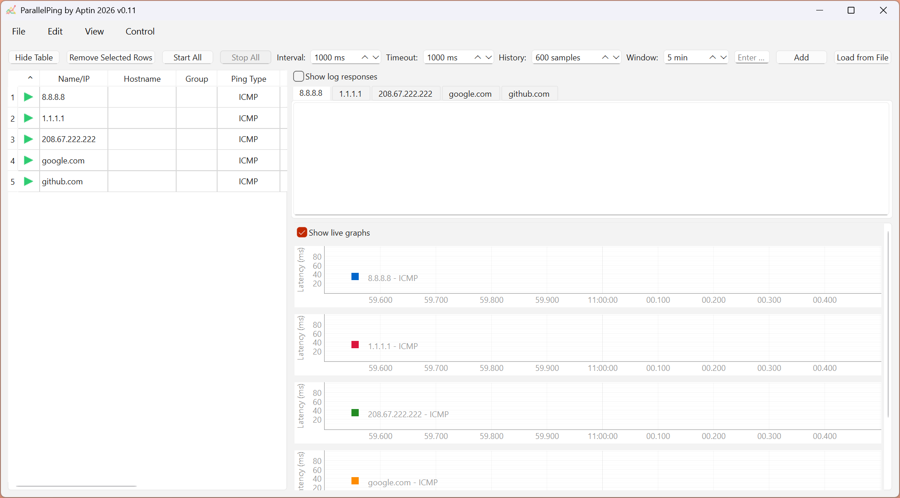

#### Target File Format

ParallelPing supports two file formats for loading targets:

**JSON Format (`target-list.json`)** — Recommended
- Standard format for ParallelPing
- Full configuration support (ping type, port, packet size, group, etc.)
- Human-readable and version-control friendly
- Structure:
  ```json
  {
    "version": "1.0",
    "targets": [
      {
        "address": "8.8.8.8",
        "label": "Google DNS",
        "ping_type": "ICMP",
        "port": 0,
        "packet_size": 32,
        "group": "Public DNS",
        "enabled": true
      },
      {
        "address": "192.168.1.1",
        "label": "Router",
        "ping_type": "ICMP",
        "port": 0,
        "packet_size": 32,
        "group": "Local Network",
        "enabled": true
      }
    ]
  }
  ```

**Plain Text Format (`.txt`)** — Simplified
- One target per line
- Simple format: `address` or `address|label` or `address|label|group|ping_type|port`
- Useful for quick imports from external sources
- Examples:
  ```
  8.8.8.8
  1.1.1.1|Cloudflare DNS
  192.168.1.1|Router|Local Network|ICMP|0
  google.com|Google|External|ICMP|0
  192.168.1.100|Server|Local Network|TCP|80
  ```

**Creating Custom Target Files:**
1. Create a `.json` or `.txt` file with your targets
2. Use **File** → **Load from File** (Ctrl+O) to import
3. Or manually type targets into the "Enter ..." box and click **Add**

#### Starting Pings

4. Click the **Start All** button in the toolbar (or press **F5**) to begin pinging all targets
5. The table will populate with real-time statistics as responses arrive:
   - Status icons (✓ or ✗) appear next to each target
   - Latency values (Min/Avg/Cur/Max) update every second
   - Graphs on the right display live latency trends
   - Packet loss percentage is calculated continuously

#### Alternative: Add Targets Manually

If you prefer to start fresh without sample targets:

1. Leave the target list empty (don't load from file)
2. Type a target address in the **"Enter ..."** text box (e.g., `192.168.1.1` or `example.com`)
3. Click **Add** or press **Enter**
4. The target appears in the table immediately
5. Repeat to add multiple targets
6. Click **Start All** when ready to begin monitoring

---

## Main Interface Overview


*Figure: ParallelPing main interface with target list (left) and real-time latency graphs (right)*

### Toolbar Buttons


*Figure 3: Main toolbar with all control buttons*

| Button | Function | Shortcut |
|--------|----------|----------|
| **Hide Table** | Toggle table visibility to maximize graph space | — |
| **Remove Selected Rows** | Deletes selected target(s) from list | Delete |
| **Start** | Begins pinging all active targets | F5 |
| **Stop** | Pauses all pings | F6 |
| **Add** | Opens dialog to add a new ping target | Ctrl+A |
| **Load from File** | Opens saved target list from file | Ctrl+O |

---

## Managing Targets


*Figure 4: Add Target dialog showing all configuration options*

### Adding a Target

1. Enter IP or hostname.
2. Click **Add** button (or press Enter or Ctrl+A)

The target immediately appears in the table.

### Modifying a Target

There are two ways to modify target settings:

#### Method 1: Right-Click Context Menu (Properties)
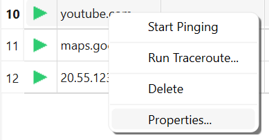


1. **Right-click** a target in the table
2. A context menu appears with options:
   - **Start Pinging**: Resume pinging if paused
   - **Run Traceroute...**: Launch network path diagnosis
   - **Delete**: Remove the target
   - **Properties...**: Open advanced configuration (this option)
3. Click **Properties...** to open the properties dialog

#### Properties Dialog
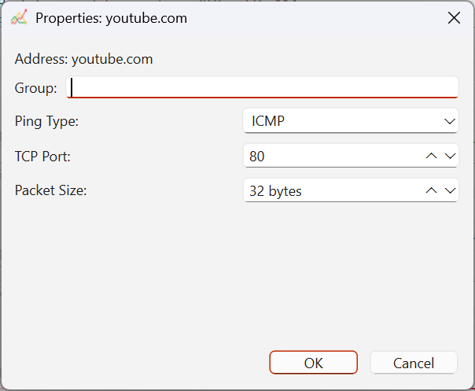


The Properties dialog allows you to modify advanced settings for a specific target:

**Dialog Fields:**

- **Address** (read-only): Shows the target's IP or hostname (cannot be changed here)

- **Group**: Text field for organizing targets
  - Enter any group name (e.g., "Production", "Testing", "DNS Servers")
  - Leave blank for no group assignment
  - Targets with the same group name are grouped together in the table
  - Use for: Organizing by department, criticality, or location

- **Ping Type**: Dropdown menu
  - **ICMP** (default): Standard ping
    - Use for: General network monitoring, routers, DNS servers
    - Pros: Fast, lightweight, widely supported
    - Cons: Blocked by some firewalls/corporate policies
  - **TCP**: Connect to a specific port
    - Use for: Firewall-blocked targets, service-specific monitoring
    - Pros: Works through most firewalls, tests specific services
    - Cons: Slightly slower, includes TCP handshake overhead (2-3ms additional)

- **TCP Port**: Spinbox (1-65535) for TCP pings
  - **Default**: 80 (HTTP web servers)
  - **Common ports**:
    - 22 = SSH (Linux/server admin)
    - 80 = HTTP (web)
    - 443 = HTTPS (secure web)
    - 3306 = MySQL (database)
    - 5432 = PostgreSQL (database)
    - 3389 = RDP (Windows remote desktop)
    - 8080 = Alternative HTTP
  - Note: Only used if Ping Type is set to TCP; ignored for ICMP
  - Tip: Check with your network admin for which ports are accessible

- **Packet Size**: Spinbox in bytes (0-65500)
  - **Default**: 32 bytes (standard Windows ping)
  - **Use cases**:
    - **32 bytes**: Normal monitoring (minimal bandwidth)
    - **1500 bytes**: Test for MTU (Maximum Transmission Unit) issues
    - **65500 bytes**: Test maximum fragmentation limits
  - **Why change it?**: Detect network configuration issues
    - If large packets fail, network may have MTU limitations
    - Useful for VPN or tunnel diagnostics
  - Note: Only applies to ICMP pings; TCP doesn't use this setting

**Buttons:**
- **OK**: Apply changes and close the dialog
- **Cancel**: Discard changes and close without saving

#### Method 2: Double-Click Row in Table

For quick edits:
1. **Double-click** a cell in the table (e.g., Group column)
2. Edit the value inline
3. Press **Enter** to save or **Escape** to cancel
4. Note: Not all columns are editable this way; use Properties for full control

### Practical Configuration Examples

**Example 1: Monitor a web server through a firewall**
1. Right-click → **Properties...**
2. Set **Ping Type** to TCP
3. Set **TCP Port** to 443 (HTTPS)
4. Click **OK**
5. Now the app will test connectivity to port 443 instead of using ICMP

**Example 2: Diagnose MTU issues**
1. Right-click → **Properties...**
2. Set **Packet Size** to 1500 (typical network MTU)
3. Click **OK**
4. Monitor the results:
   - Success = network supports 1500-byte packets
   - Timeout = possible MTU issue; network may fragment or drop large packets
5. Try smaller sizes (1400, 1300) to find the MTU limit

**Example 3: Organize targets by department**
1. Add targets from different departments
2. For each target, right-click → **Properties...**
3. Set **Group** to the department name:
   - Finance: Group = "Finance"
   - Engineering: Group = "Engineering"
   - Operations: Group = "Operations"
4. Click **OK**
5. Targets now appear grouped in the table by department

**Example 4: Monitor multiple database servers on different ports**
1. Add target "database-primary" → TCP port 3306 (MySQL)
2. Add target "database-backup" → TCP port 3306 (MySQL)
3. Add target "cache-server" → TCP port 6379 (Redis)
4. Group them all as "Databases"
5. Monitor all service connections in one view

### Removing Targets

1. Select one or more targets in the table
2. Press **Delete** or click **Remove**
3. Confirm the removal

### Pausing/Resuming Individual Targets

Targets can be temporarily paused without removal:
- **Right-click** a target → **Pause** (or resume)
- Paused targets show a pause icon and do not consume ping requests
- Statistics continue to display historical data

### Organizing with Groups

Targets can be organized into groups for easier management:
1. Add targets with group names (e.g., "Production", "Testing")
2. Groups appear as visual separators in the table
3. Right-click a group to **Pause Group** or **Resume Group** at once

---

## Monitoring & Visualization

### Target List Table

The left side of the main window displays all targets with real-time latency statistics, ping results, and status information updated every second. The table provides a detailed view of each target's performance metrics.

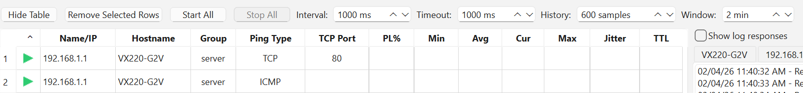

#### Table Overview

The table contains the following columns, organized from left to right:

| Column | Type | Meaning |
|--------|------|---------|
| **Status** | Icon | Connection status indicator (✓ = online/responding, ✗ = offline/no response) |
| **Name/IP** | Text | The target's name/address (as entered when adding) |
| **Hostname** | Text | Resolved hostname via reverse DNS lookup (for IP addresses) |
| **Group** | Text | Target group/category (for organizing related targets) |
| **Ping Type** | Text | Protocol used (ICMP or TCP) |
| **TCP Port** | Number | Port number for TCP pings (blank/disabled for ICMP) |
| **PL%** | Number | Packet loss percentage (0–100%) |
| **Min** | Number | Minimum latency in the current time window (milliseconds) |
| **Avg** | Number | Average latency in the current window (milliseconds) |
| **Cur** | Number | Current (latest) latency from the most recent ping (milliseconds) |
| **Max** | Number | Maximum latency in the current window (milliseconds) |
| **Jitter** | Number | Latency variation/standard deviation (lower = more stable) |
| **TTL** | Number/Text | Time-to-Live value (ICMP only; TCP shows "N/A") |

#### Understanding Column Values

**Status Column:**
- ✓ (Green checkmark): Target is responding to pings
- ✗ (Red X): Target is not responding (offline or blocking pings)
- Spinning icon: Waiting for first response after startup

**Packet Loss (PL%):**
- 0% = All pings received
- 1-30% = Occasional packet loss (acceptable for most use cases)
- 31-99% = Significant packet loss (network/firewall issues)
- 100% = No responses received (target offline or unreachable)

**Latency Values (Min/Avg/Cur/Max):**
- Measured in milliseconds (ms)
- Typically: Local LAN < 10ms, Local ISP < 30ms, Remote < 100ms
- Values depend on target distance, network congestion, and quality
- Yellow highlight on Avg column indicates elevated latency (relative to that target's baseline)

**Jitter:**
- Measures variation in latency over time
- Low jitter (< 5ms) = Stable, consistent connection
- Medium jitter (5-20ms) = Some variability, acceptable
- High jitter (> 20ms) = Unstable connection, potential packet loss issues
- Jitter is calculated across the current time window

**TTL (Time-to-Live):**
- Only shown for ICMP pings; TCP shows "N/A"
- Indicates the network hop count from source to target
- When TTL changes:
  - ↑ arrow indicates TTL increased (routing changed to longer path)
  - ↓ arrow indicates TTL decreased (routing changed to shorter path)
  - Orange background highlights the cell to draw attention
  - A dashed orange vertical line also appears on the target's graph at the exact moment

#### Hiding the Table

To maximize graph space or focus on statistics only, you can hide the table:
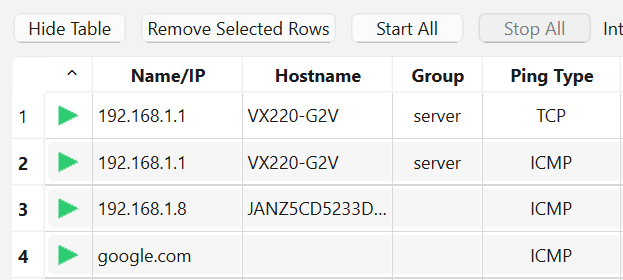

**Method 1: Click "Hide Table" Button**
- Located in the **top toolbar** (left side)
- Click to toggle table visibility on/off
- When hidden, graphs expand to fill the entire main window

**Method 2: Resize via Splitter**
- Move the vertical divider between table and graphs all the way to the left
- This effectively hides the table and maximizes graph space

#### Using the Table Effectively

**Quick scanning:**
- Focus on **Avg** and **PL%** columns for overall target health
- Red highlighting on Avg indicates problems
- High PL% + low latency = firewall filtering, not network problems
- High PL% + high latency = actual network congestion

**Identifying issues:**
1. High Avg but low Jitter = Consistently slow target (not variable)
2. Normal Avg but high Jitter = Intermittent congestion
3. Increasing Max without increasing Avg = Occasional spikes (acceptable)
4. All values increasing together = Network-wide issue

**Comparing targets:**
- Use **Group** column to organize related targets
- Targets in the same group appear consecutively in the table
- Compare Avg values across similar targets to identify slowest ones

**Sorting and searching:**
- Click column headers to sort (click again to reverse)
- Example: Click **Avg** to sort by latency (identifies slowest targets)
- Example: Click **PL%** to find targets with packet loss

**Reordering targets:**
- Drag and drop table rows to reorder targets
- Order is preserved when you save to target-list.json

#### Column Alignment and Formatting

- **Numeric columns** (Min, Avg, Cur, Max, Jitter, PL%, TTL): Center-aligned for easy scanning and comparison
- **Text columns** (Name/IP, Hostname, Group, Ping Type): Left-aligned for readability
- **Status column**: Centered icon for quick visual scanning
- **Highlighted cells**: Orange background indicates TTL changes; Yellow indicates elevated latency

#### Performance Note

With 50+ targets:
- Table may scroll slowly with frequent updates
- Consider hiding the table and focusing on graphs (use Hide Table)
- Or reduce ping interval to decrease update frequency
- Alternatively, disable "Update Graphs" checkbox to reduce CPU usage

### TTL (Time-to-Live) Monitoring

The TTL column displays the TTL value from ICMP responses:
- **ICMP**: Shows the current TTL value
  - ↑ arrow indicates TTL increased (likely routing change)
  - ↓ arrow indicates TTL decreased (likely routing change)
  - Orange background highlights when TTL changes
- **TCP**: Shows "N/A" (TTL not applicable for TCP pings)
- **No Response**: Shows "—"

**Route Change Detection:**
When a TTL change is detected (indicating a BGP route change or failover), a **dashed orange vertical line** appears on the corresponding graph, marking the exact moment the route changed. This helps identify when network path changes occurred.

**Alignment**: Most numeric columns (Min, Avg, Max, etc.) are center-aligned for easy scanning. Name/IP, Hostname, and Status columns are left-aligned.

### Controls & Checkboxes

#### Show log responses Checkbox
- Located **above the log tabs** (bottom-left area)
- When checked: Each ping response is captured with timestamp for export
- When unchecked: Only statistics are tracked (saves memory)
- Default: Unchecked

#### Show live graphs Checkbox
- Located **above the graph area** (top of right pane)
- When checked: Graphs update in real-time (default)
- When unchecked: Graph updates are paused to reduce CPU usage
- Useful for: Monitoring on low-power devices or when CPU is limited

### Log Response Tab View

The log response view displays detailed per-target ping logs with timestamps and response details.

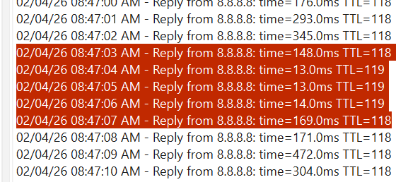

#### Accessing Log Responses

1. **Enable** the **"Show log responses"** checkbox (located above the log tabs, bottom-left area)
2. Log tabs appear dynamically for each target as they ping
3. Each target gets its own tab showing chronological log entries
4. Tabs are labeled with the target's hostname or IP address

#### Understanding Log Entries

Each log entry shows:
- **Timestamp**: Date and time in format "MM/DD/YY HH:MM:SS AM/PM"
- **Status**: "Reply from [target]" or "Request timed out for [target]"
- **Latency**: Response time in milliseconds (e.g., "time=29.0ms")
- **TTL**: Time-to-Live value for ICMP responses (e.g., "TTL=114")

**Example log entries:**
```
02/04/26 11:40:32 AM - Reply from youtube.com: time=29.0ms TTL=114
02/04/26 11:40:33 AM - Reply from youtube.com: time=21.0ms TTL=114
02/04/26 11:40:34 AM - Reply from youtube.com: time=19.0ms TTL=114
02/04/26 11:40:35 AM - Request timed out for youtube.com
02/04/26 11:40:36 AM - Reply from youtube.com: time=21.0ms TTL=114
```

#### Using Log Responses

**Export logs:**
1. Enable **Show log responses** during monitoring
2. Click **Export** (Ctrl+E) when done
3. Select "Include ping log responses" in the export dialog
4. Choose CSV or Excel format
5. All logged entries are included in the export file
6. Useful for: Analysis, reporting, and historical reference

**Monitor in real-time:**
- Keep the log tab visible during monitoring to see responses as they occur
- Useful for: Quick troubleshooting, identifying exact failure moments
- Scroll through logs to correlate timing with graph events

**Identify failure patterns:**
- Look for clusters of "Request timed out" entries
- Note the exact times to correlate with graph packet loss markers
- Check if failures occur at regular intervals (possible timing issue)

#### Performance Considerations

⚠️ **WARNING: Performance Impact**

Enabling log responses with many targets (10+) and live graphs enabled can significantly impact performance:

**Performance Impact Chart:**
- **1-5 targets**: Minimal impact, safe to enable logging
- **6-20 targets**: Moderate impact, consider if live graphs are needed
- **20-50 targets**: Significant impact, disable live graphs or logging
- **50+ targets**: High risk of slowdown, disable both or reduce to <20 targets

**What happens with high target counts:**
- Each ping generates a log entry (1 per target per second = 60 entries/minute for 60 targets)
- Both logs and live graphs update simultaneously, taxing CPU and RAM
- UI becomes sluggish or unresponsive
- System may become unstable or crash in extreme cases

**Optimization strategies:**
1. **For logging with many targets**: Disable "Show live graphs"
2. **For live graphs with many targets**: Disable "Show log responses"
3. **For both**: Limit to <10 targets, or increase "History" window to reduce update frequency
4. **For large deployments (50+ targets)**: Consider using a server-based monitoring solution (Nagios, Zabbix, Grafana)

**Recommendation:**
- **Standard monitoring (1-20 targets)**: Both logging and graphs enabled
- **Network-wide monitoring (20-100 targets)**: Graphs only, periodic log exports
- **Enterprise scale (100+ targets)**: Separate monitoring infrastructure needed

### Live Latency Graph


*Figure 5: Real-time latency graph showing multiple targets with hover tooltip*

The right side displays a **real-time plot** of latency over time:

- **X-axis**: Time (samples taken at 1-second intervals)
- **Y-axis**: Latency in milliseconds
- **Each target**: Plotted as a separate colored line
- **Scrolling**: Graph shows the rolling 5-10 minute window (configurable)
- **Legend**: Top-left corner shows target labels with color-coded squares

[PLACEHOLDER: Screenshot showing live graph view with multiple targets, legend, and "Show live graphs" checkbox]

#### Enabling/Disabling Live Graphs

**To enable live graphs:**
1. Check the **"Show live graphs"** checkbox (located above the graph area, top of right pane)
2. Graphs begin updating in real-time as pings complete
3. Default: Enabled

**To disable live graphs:**
1. Uncheck the **"Show live graphs"** checkbox
2. Graphs freeze at current state (no further updates)
3. Historical data remains visible but won't advance
4. This pauses graph rendering, reducing CPU usage significantly

**When to disable:**
- Running many targets (20+) to reduce CPU load
- Working on low-power devices (laptops, VMs)
- Need to examine historical data without updates
- App feels sluggish or unresponsive

#### Understanding the Graph Display

**Graph elements:**
- **Colored lines**: Each target has its own colored line showing latency over time
- **Legend**: Top-left shows all targets with color-coded labels:
  - Format: "IP Address - Ping Type - [Port if TCP]"
  - Example: "192.168.1.1 - ICMP" or "google.com - TCP - 80"
- **Grid**: Background grid helps estimate values and timing
- **Y-axis**: Starts at 0 ms at the bottom (no negative values)

**Real-time updates:**
- Graph scrolls left as time progresses (rolling 5-10 minute window)
- New data points appear on the right edge
- Oldest data points disappear off the left edge
- Updates occur approximately once per second

#### Interpreting Multiple Targets on One Graph

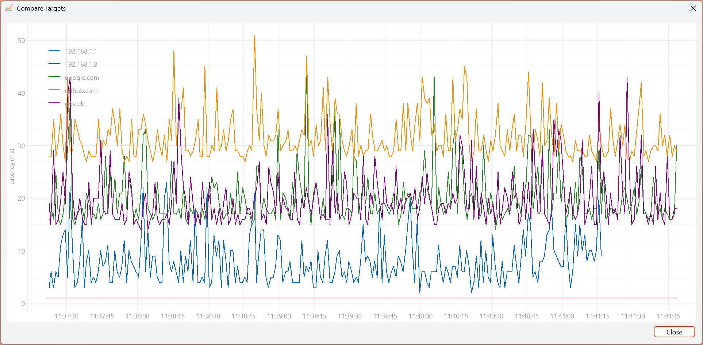

When monitoring multiple targets simultaneously:

**Comparing targets visually:**
- **Targets with similar patterns**: Same network path or conditions
- **One target spiking while others stable**: Problem specific to that target
- **All targets spiking together**: Network-wide issue (your ISP or network)
- **One target showing high noise (jitter)**: Unstable connection or high variance

**Analyzing patterns across targets:**
1. Look for **synchronized changes** across multiple targets
   - All spike together → upstream network issue
   - Only one affected → destination-specific problem
2. Watch for **offset patterns**
   - Each target has different baseline → different routes/distances
   - Similar baselines → likely same route or similar distances
3. Identify **anomalies**
   - Sudden drops → failover to faster route
   - Sudden spikes → failover to slower route or network congestion

#### Performance Considerations

⚠️ **WARNING: Performance Impact**

Live graph rendering with many targets (20+) can significantly impact CPU and GPU usage:

**Performance Impact Chart:**
- **1-5 targets**: Minimal CPU impact, smooth performance
- **6-15 targets**: Low-moderate CPU usage, generally acceptable
- **15-30 targets**: Moderate-high CPU usage, may notice lag
- **30-50 targets**: High CPU usage, noticeable slowdown
- **50+ targets**: Very high CPU usage, app may freeze or crash

**What happens with many live graphs:**
- Each target's graph updates 1-2 times per second (based on ping interval)
- GPU renders hundreds of line segments per update
- Memory grows as history accumulates (each target = ~10 KB per 10 minutes)
- UI thread may be blocked by graph rendering, causing responsiveness issues

**Optimization strategies:**
1. **Disable live graphs**: Uncheck "Show live graphs" when monitoring 20+ targets
   - Graphs still show historical data, just don't update
   - Can re-enable when you need real-time view
2. **Reduce target count**: Split into multiple monitoring sessions
3. **Increase ping interval**: From 1 second to 5 seconds reduces update frequency
4. **Reduce history window**: Show only 5 minutes instead of 10 minutes
5. **Use Compare mode sparingly**: Don't keep the Compare window open with many targets

**Recommended configuration by target count:**
- **1-10 targets**: All features enabled, no issues expected
- **11-20 targets**: Live graphs + logs OK, but monitor CPU usage
- **21-50 targets**: Live graphs only (disable logs), or logs only (disable graphs)
- **50+ targets**: Neither live graphs nor logs; use export/batch processing instead

**Recommendation:**
Enable "Show live graphs" for active monitoring and investigation, but disable it when monitoring large numbers of targets passively. You can always re-enable temporarily to investigate specific events.

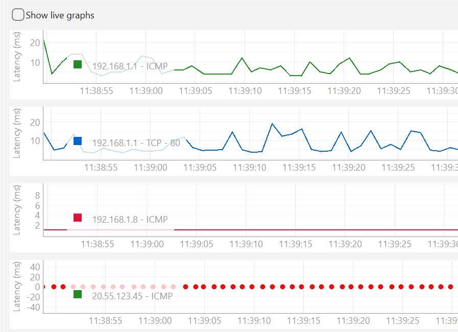
*Figure 5: Real-time latency graph showing multiple targets with hover tooltip*

The right side displays a **real-time plot** of latency over time:

- **X-axis**: Time (samples taken at 1-second intervals)
- **Y-axis**: Latency in milliseconds
- **Each target**: Plotted as a separate colored line
- **Scrolling**: Graph shows the rolling 5-10 minute window (configurable)

#### Hover Tooltip
Move your mouse over the graph to see:
- **Exact timestamp** of the data point
- **Latency value** for the target at that moment
- Crosshair guides to help identify data points

#### Packet Loss Markers

Packet loss is visualized directly on the graph with **red dot markers** positioned on the x-axis (at y=0):

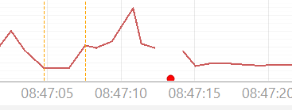

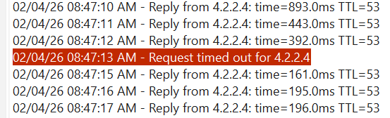

**How to identify packet loss:**
- **Red dots on x-axis**: Each red dot represents a ping that timed out (no response)
- **Position**: Dots appear at the exact timestamp when the timeout occurred
- **Density**: Multiple red dots close together indicate sustained packet loss
- **Correlation**: Check the log responses for "Request timed out" entries at those timestamps

**Example interpretation:**
```
Log Entries:                              Graph View:
08:47:12 - Reply ... TTL=53              [Graph line continues normally]
08:47:13 - Request timed out             [RED DOT appears on x-axis]
08:47:14 - Reply ... TTL=53              [Graph line resumes]
08:47:15 - Reply ... TTL=53              [Graph line continues]
08:47:16 - Request timed out             [RED DOT appears on x-axis]
```

**What packet loss markers indicate:**
- **Isolated dots**: Occasional network issues or intermittent connectivity
- **Clusters of dots**: Sustained network problems or service outages
- **Dots after latency spike**: Possible network congestion leading to timeouts
- **Dots with no latency change**: Possible firewall/timeout configuration issues

**Monitoring packet loss visually:**
- Watch for patterns in red dot distribution
- Combine with the **PL% (Packet Loss %)** column in the table for exact percentages
- Export log responses to analyze which times had the most loss
- Correlate with route change markers (orange dashed lines) to see if path changes cause loss

### Interpreting Results

| Condition | Meaning | Action |
|-----------|---------|--------|
| **Steady low latency** | Network is healthy | Monitor for changes |
| **Increasing latency** | Network congestion | Check if network load is high |
| **Packet loss > 0%** | Unreliable connection | Investigate network issues or target availability |
| **High jitter** | Unstable connection | May indicate congestion or network problems |
| **No response** | Target offline or blocking ICMP | Try TCP ping or verify target is reachable |

---

## Advanced Features

### Compare Multiple Targets

The Compare feature allows you to overlay multiple targets on a single graph for side-by-side analysis and pattern identification.

#### Accessing Compare Mode

**Method 1: Using Keyboard Shortcut**
1. In the main window, select multiple targets in the table:
   - **Ctrl+Click**: Select individual targets
   - **Shift+Click**: Select a range of targets
2. Press **Ctrl+M** to open the Compare dialog

**Method 2: Using Right-Click Context Menu**
1. Select multiple targets in the table (as above)
2. Right-click one of the selected targets
3. Select **Compare Targets** from the context menu

**Method 3: Using File Menu**
1. Select multiple targets
2. Go to **View** menu (if available) or use the keyboard shortcut

#### Compare Window Overview


The Compare window displays:
- **Single unified graph**: All selected targets plotted with different colors
- **Legend** (top-left): Lists all targets with color indicators
  - Format: "IP Address" or "Hostname"
  - Color-coded to match the plotted lines
- **X-axis**: Time (same scale as main graph)
- **Y-axis**: Latency in milliseconds
- **Grid**: Background grid for reference
- **Close button**: Dismiss the Compare window

#### Understanding the Compare View

**What you see:**
- Each target appears as a different colored line
- All targets share the same time scale and Y-axis
- Can compare relative latencies, patterns, and timing simultaneously
- Patterns that align indicate similar network conditions

**Color coding:**
- Each target gets a unique color (same as in main graphs)
- Legend shows which color corresponds to which target
- Easy to track individual target behavior across the graph

#### Analyzing Comparison Results

**Example 1: Comparing local vs. remote targets**
```
192.168.1.1 (blue):    Flat at 5ms   (local gateway - stable)
8.8.8.8 (green):       Varies 25-35ms (ISP DNS - some jitter)
google.com (orange):   Varies 30-50ms (remote service - higher variance)
```
→ Conclusion: Local is stable, remote has more jitter (expected due to distance)

**Example 2: Identifying service-specific issues**
```
192.168.1.1 (blue):    Flat at 5ms   (local router - stable)
192.168.1.10 (red):    Flat at 2ms   (local server - stable)
google.com (orange):   Spikes to 100ms (intermittent issue with remote)
```
→ Conclusion: Local network is fine, but remote service has problems

**Example 3: Detecting simultaneous outages**
```
All targets together:   Normal until 11:38:45
At 11:38:45:          All targets spike simultaneously
Recovery:             All targets recover at 11:39:10
```
→ Conclusion: Network-wide event (ISP issue, router restart, etc.)

#### Comparison Techniques

**Visual pattern matching:**
1. Look for lines that **move together** (synchronized patterns)
   - Synchronized = shared network segment or condition
   - Independent = separate paths or issues
2. Watch for **offset patterns**
   - Baseline latency differences indicate different distances
   - Similar baselines suggest similar routes
3. Identify **outliers**
   - One target behaving differently = target-specific issue
   - All targets behaving similarly = network-wide issue

**Timing correlation:**
1. Do spikes occur at the **same time** across multiple targets?
   - Yes → upstream/ISP issue (affects all)
   - No → destination-specific problem
2. Do targets **recover together** or at different times?
   - Together → network event (packet loss burst)
   - Staggered → different routing paths
3. Are there **regular patterns** (spikes every N seconds)?
   - Yes → possible routing timeout, load balancing, or application issue
   - No → random congestion or network events

#### Practical Use Cases

**Detect ISP problems:**
1. Add multiple external targets (Google DNS, Cloudflare, GitHub, etc.)
2. Compare their patterns
3. If all spike together → ISP issue
4. If only some spike → issue with those specific services

**Verify service redundancy:**
1. Add primary and backup servers to monitoring
2. Compare their latencies over time
3. If both stable and similar → redundancy working
4. If one fails while other continues → failover is working

**Network path analysis:**
1. Add targets at different "hops" (local router, ISP gateway, remote server)
2. Compare their latencies
3. Latency should roughly increase with distance
4. If not, may indicate routing issues or misconfiguration

**Troubleshoot load balancing:**
1. Add the same target multiple times (if behind load balancer)
2. See if each connection gets different server responses
3. Consistent latency = balanced loading
4. Erratic latency = potential load balancer issues

**Monitor failover behavior:**
1. Add primary and secondary services
2. Monitor during a failover event
3. Watch for:
   - When primary drops
   - When secondary takes over
   - How long transition takes
   - If latency changes after failover
4. Document timing for incident reports

#### Tips for Effective Comparison

- **Select 2-5 targets**: Too many makes the graph cluttered
- **Monitor for 5-10 minutes**: Enough time to see patterns
- **Keep window open while monitoring**: Compare updates with main graphs in real-time
- **Use same Ctrl+M to close**: Or click the Close button
- **Export data**: After identifying patterns, export logs for detailed analysis
- **Combine with log exports**: Correlate timing of spikes with packet loss or errors

#### Performance Note

Running Compare mode with many targets (10+) may impact performance similar to live graphs:
- Each target still updates in real-time on the main window
- Compare graph updates simultaneously
- For 10+ targets, consider:
  - Disabling live graphs on main window while comparing
  - Keeping Compare window small/minimized
  - Closing Compare when not actively analyzing

### BGP Route Change Detection (TTL Tracking)

ParallelPing automatically detects network routing changes by monitoring TTL (Time-to-Live) values in ICMP responses. When a BGP route change occurs (failover, load balancing adjustment, or network reconfiguration), the TTL value changes, and ParallelPing marks it visually.

#### How It Works

**What ParallelPing monitors:**
- Every ICMP ping response includes a TTL value
- The baseline TTL is established from the first successful ping (after a 10-second suppression window at startup)
- Any change ≥ 1 in the TTL value triggers route change detection
- The detection is suppressed for the first 10 seconds after starting to avoid false alarms

**Example (from logs):**
```
08:47:01 AM - Reply from 8.8.8.8: time=293.0ms TTL=118
08:47:02 AM - Reply from 8.8.8.8: time=356.0ms TTL=118
08:47:03 AM - Reply from 8.8.8.8: time=148.0ms TTL=118
08:47:04 AM - Reply from 8.8.8.8: time=13.0ms TTL=119    ← Route changed!
08:47:05 AM - Reply from 8.8.8.8: time=13.0ms TTL=119
08:47:07 AM - Reply from 8.8.8.8: time=169.0ms TTL=118   ← Route changed again!
```

#### Visual Indicators in Table View
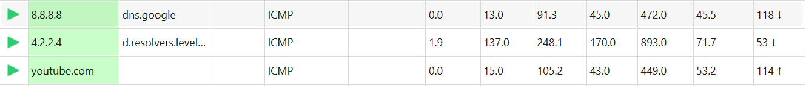
In the **TTL column** (rightmost), you'll see:
- **Current TTL value** (e.g., "118", "119")
- **↑ Arrow** next to value when TTL **increases** (e.g., "119 ↑")
- **↓ Arrow** next to value when TTL **decreases** (e.g., "118 ↓")
- **Orange background** cell highlighting when a TTL change occurs
- **N/A** for TCP pings (TTL only applies to ICMP)

#### Visual Indicators in Graph View
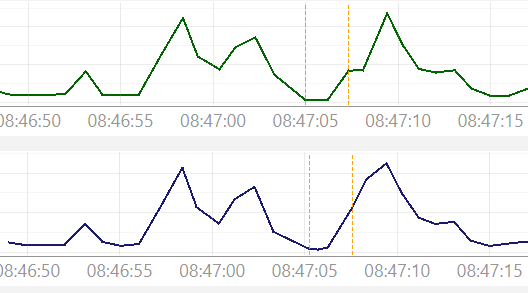

When a route change is detected, a **dashed orange vertical line** appears on the graph at the exact moment the TTL changed:

**What you'll observe:**
- **Vertical dashed orange line**: Marks the precise timestamp of the route change
- **Concurrent latency changes**: Often (but not always) accompanied by latency shifts:
  - Sudden drop in latency → faster route
  - Sudden spike in latency → slower route
  - Relatively stable latency → load balancing to equal-cost route

**Multi-target comparison:**
- If all targets show route changes at the same time → your ISP or network likely changed routes
- If only one target changes → routing change specific to that destination

#### Interpreting Route Changes

| Observation | Likely Cause | Action |
|-------------|-------------|--------|
| **Single TTL change, no latency change** | Load balancing (equal-cost multipath) | Monitor for stability; no action needed |
| **TTL increases, latency decreases** | Failover to a faster/shorter route | Positive; connection improved |
| **TTL decreases, latency increases** | Failover to a slower/longer route | May indicate ISP issues; contact ISP if persistent |
| **Frequent TTL changes (every few seconds)** | Aggressive load balancing or BGP flapping | Contact ISP; network may be unstable |
| **One route change, then stable** | Normal BGP convergence during ISP failover | Check if caused by ISP maintenance |

#### Practical Use Cases

**Detect ISP failovers:**
1. Add Google DNS (8.8.8.8) and Cloudflare (1.1.1.1) to monitoring
2. Watch the TTL column and graphs during network issues
3. Orange route change markers indicate when your ISP switched to backup routes

**Validate network redundancy:**
1. Add your critical servers to monitoring
2. Trigger a failover test in your network
3. Confirm route changes appear in ParallelPing's TTL column and graph markers
4. Verify latency remains within acceptable range after failover

**Troubleshoot carrier-level issues:**
1. Run ParallelPing for an hour during reported outages
2. Export the log responses to CSV
3. Look for patterns: Do all targets change routes together? Are there multiple route changes?
4. Share this data with your ISP to help diagnose issues

### Traceroute Diagnostics

Trace the network path to a target to identify bottlenecks and understand the route your packets take.

#### Accessing Traceroute

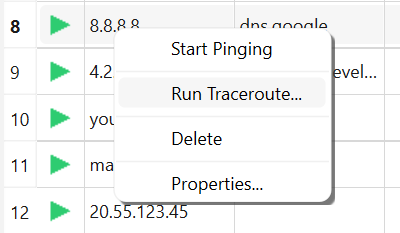

1. **Right-click** any target in the table
2. A context menu appears with options:
   - **Start Pinging**: Resume pinging if paused
   - **Run Traceroute...**: Launch the traceroute dialog (this option)
   - **Delete**: Remove the target
   - **Properties...**: Edit target configuration
3. Click **Run Traceroute...** to begin

#### Traceroute Results Dialog

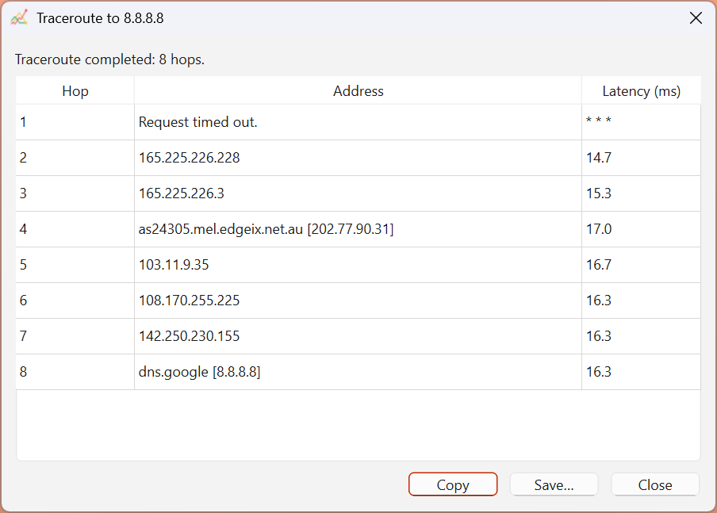

The traceroute dialog displays comprehensive network path information:

**Dialog Components:**
- **Status line**: Shows "Traceroute completed: X hops"
- **Hop column**: Sequential hop numbers (1, 2, 3, ... to target)
- **Address column**: 
  - IP address of the router/gateway
  - Resolved hostname if available (in brackets)
  - "Request timed out." if hop did not respond (marked as * * *)
- **Latency column**: 
  - Response time in milliseconds
  - "* * *" if no response received
- **Buttons**: Copy, Save, Close

#### Using Traceroute Results

**Copy to Clipboard:**
1. Click **Copy** to copy all results as tab-separated text
2. Paste into email, document, or chat for sharing
3. Useful for: Sharing network path with colleagues or ISP support

**Save to File:**
1. Click **Save...** 
2. Choose format (CSV or text file)
3. Select location and filename
4. Results are exported for archival or further analysis

**Close Dialog:**
1. Click **Close** to dismiss the traceroute window
2. You can continue monitoring while the window is open
3. Right-click the same target to run traceroute again

#### Interpreting Traceroute Results

**Understanding the path:**
- **Hop 1**: Your local gateway (usually 0.x or 1.x ms)
- **Hops 2-N**: ISP backbone routers
- **Final hop**: Your target destination
- **Total hops**: Indicates network distance (usually 8-16 for international)

**Latency expectations:**
```
Hop 1: 0.5 ms   (local gateway)
Hop 2: 5 ms     (ISP first node)
Hop 3: 10 ms    (regional node)
Hop 4: 15 ms    (backbone)
Hop 5: 20 ms    (target country entry)
Hop 8: 25 ms    (destination reached)
```

- **Normal pattern**: Latency generally increases with each hop
- **Sudden jump**: Indicates a longer network segment
- **No increase**: Equal-cost multipath routing (load balancing)

**Identifying problem hops:**
- **"Request timed out" (*)**: Hop doesn't respond to traceroute requests
  - May be intentionally blocked by the hop's administrator
  - Not necessarily a problem; ping still works through it
- **Sudden latency spike**: 
  - May indicate congestion or distance
  - Look at latency from that hop to destination
- **Inconsistent responses**: Run traceroute multiple times to confirm

#### Practical Traceroute Scenarios

**Example 1: High latency to a server**
```
Traceroute shows:
Hop 1: 0.5 ms (you)
Hop 2: 5 ms (ISP)
Hop 3: 10 ms (ISP backbone)
Hop 4: 150 ms ← SPIKE! (international link)
Hop 5: 155 ms (target country)
Hop 6: 160 ms (server)
```
→ The 150ms jump at Hop 4 indicates a slow international link; expected for overseas targets

**Example 2: Diagnosing packet loss**
1. If you see packet loss in ParallelPing
2. Run traceroute to the same target
3. Look for "Request timed out" or unusual latencies
4. Contact your ISP if a specific hop is problematic
5. Run traceroute again later to see if the hop recovers

**Example 3: Verifying routing after TTL change**
1. You notice a TTL change on the graph (orange marker)
2. Run traceroute immediately before and after the change
3. Compare the hop counts and paths
4. If hop count increased/decreased, the route definitely changed
5. If latency differs, it confirms the new path's characteristics

#### Combining with TTL Tracking

**TTL in Traceroute vs. TTL Tracking:**
- **Traceroute TTL**: Shows how many hops exist to reach target (count of hops)
- **TTL Tracking**: Monitors if the hop count (TTL value) changes over time
- **Together**: If TTL tracking shows a change, run traceroute to confirm the new route

**Workflow:**
1. Monitor for TTL changes in ParallelPing (watch for orange markers on graph)
2. When a change is detected, run traceroute
3. Note the number of hops and latencies
4. Run again after an hour to see if the new route is stable
5. If unstable or problematic, contact your ISP with this data

### Traceroute Diagnostics (Advanced)

The traceroute feature (Windows `tracert` command) works by gradually increasing the TTL value in packets and observing which routers respond, creating a map of the network path to your target.

**Interpreting Traceroute:**
- Each line represents a router hop to the target
- Latency should generally increase with each hop
- `* * *` means the hop did not respond
- Look for sudden latency spikes to identify problem routers

**Combining with TTL Tracking:**
- Use Traceroute to see the physical network path at one point in time
- Use TTL tracking to detect when that path changes
- Run Traceroute again after a TTL change to see the new route

### Export Data

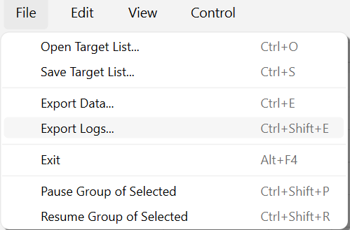

*Figure 8: Export dialog with format and data selection options*

Export ping history and statistics for analysis in Excel, spreadsheet, or data analysis tools:

1. Click **Export** (or press Ctrl+E)
2. Choose export format:
   - **CSV**: Text format, opens in Excel or text editors
   - **Excel (.xlsx)**: Formatted spreadsheet with charts
3. Select **which data to include**:
   - Ping history (all samples)
   - Summary statistics
   - Per-target details
4. Choose save location and filename
5. Open the file to analyze results

**CSV Format Example:**
```
Timestamp,Target,Latency (ms),Status
2025-01-05 10:00:01,8.8.8.8,25.3,Success
2025-01-05 10:00:02,8.8.8.8,24.8,Success
2025-01-05 10:00:03,8.8.8.8,None,Loss
```

### Save & Load Target Lists

#### Saving
1. Configure your targets as desired
2. Click **Save** (or press Ctrl+S)
3. Choose a filename and location
4. File is saved in JSON format (human-readable)

#### Loading
1. Click **Load** (or press Ctrl+O)
2. Select a previously saved target list
3. Current targets are replaced with the loaded list
4. Pinging restarts automatically

**Auto-Load on Startup:**
If a file named `target-list.json` exists in the ParallelPing directory, it will be automatically loaded when the app starts.

### Customizing Targets

#### Ping Type: ICMP vs. TCP

**ICMP Ping** (Default)
- ✓ Fast and lightweight
- ✓ Works with most networks
- ✗ Blocked by some firewalls
- **Use for**: General network monitoring, routers, cloud infrastructure

**TCP Ping**
- ✓ Works through many firewalls
- ✓ Can test specific services (port 443 for HTTPS, 3306 for MySQL, etc.)
- ✗ May show longer latency if service is slow
- **Use for**: Testing service availability, firewall-restricted targets

#### Custom Packet Size
- **Default**: 32 bytes (standard ping)
- **Increase to**: Detect MTU (Maximum Transmission Unit) issues
  - Try 1500 bytes; if it fails, the link may have MTU problems
- **Use for**: Diagnosing fragmentation and network configuration issues

---

## Keyboard Shortcuts

| Shortcut | Action |
|----------|--------|
| **Ctrl+A** | Add new target |
| **Delete** | Remove selected target(s) |
| **F5** | Start pinging |
| **F6** | Stop pinging |
| **Ctrl+S** | Save target list |
| **Ctrl+O** | Open/load target list |
| **Ctrl+E** | Export to CSV/Excel |
| **Ctrl+M** | Compare selected targets |
| **Ctrl+Q** | Quit application |
| **Escape** | Close dialogs |

---

## Tips & Troubleshooting

### Common Issues

#### "No response" for all targets
- **Check**: Is pinging enabled? Click **Start** (F5)
- **Check**: Is internet connection active? Test by opening a browser
- **Solution**: Click **Start** to begin pinging again

#### ICMP Ping Shows No Response but TCP Succeeds
- **Cause**: Firewall or network policy is blocking ICMP
- **Solution**: Use TCP ping instead (change Ping Type to "TCP")
- **Alternative**: Ask IT to allow ICMP, or use a different port

#### High Jitter or Packet Loss
- **Cause**: Network congestion, Wi-Fi interference, or a problematic ISP route
- **Check**: Use **Compare** mode to see if other targets are affected
- **Check**: Use **Traceroute** to identify which hop is problematic
- **Action**: Check your router temperature, Wi-Fi signal strength, or contact your ISP

#### Graph Scrolls Slowly or App Feels Sluggish
- **Cause**: Too many targets or very long history window
- **Solution**: Reduce number of simultaneous targets, or close the compare window
- **Solution**: Right-click window → **Clear History** to start fresh

#### Can't Save or Load Target Lists
- **Check**: Ensure the folder is writable (not on a read-only network drive)
- **Check**: Disk space is available
- **Check**: File is not open in another program

### Performance Tips

1. **Limit active targets**: 20–30 targets usually runs smoothly; very large numbers (100+) may slow down the UI
2. **Use appropriate timeouts**: 1000 ms (1 second) is standard; higher values mean slower feedback but reduced network traffic
3. **Close unnecessary dialogs**: Keep Compare and Traceroute windows closed when not needed
4. **Reduce ping interval**: By default, targets are pinged every 1 second; this is optimal for most use cases
5. **Monitor on a dedicated monitor**: Running ParallelPing on a second display helps keep it visible during work

### Network Diagnostics with ParallelPing

**Identify ISP problems:**
1. Add 3–4 targets (local router, ISP gateway, public DNS, public service)
2. Check if loss/jitter affects all targets equally (entire link problem) or specific targets (service issue)
3. Use Traceroute to see which hop introduces latency

**Test VPN or Proxy:**
1. Add targets inside and outside your VPN
2. Compare latency increase
3. If VPN causes >50% latency increase, consider optimizing VPN configuration

**Monitor during data transfers:**
1. Keep ParallelPing running while uploading/downloading large files
2. Watch for latency spikes during transfer (indicates network saturation)
3. Use jitter to detect if connection is becoming unstable

---

## Getting Help

### Built-in Help
- **Hover over buttons**: Tooltips explain each feature
- **Right-click a target**: Context menu shows available actions
- **Double-click a column header**: Sorts results

### Reporting Issues
If you encounter a bug:
1. Note the exact steps to reproduce
2. Check your internet connection
3. Ensure you're using the latest version
4. Report with: target address, error message, and operating system version

### Keyboard Shortcut Reference
Press **Ctrl+?** (or check this manual) to view all available shortcuts at any time.

---

## FAQ

**Q: Will ParallelPing work on macOS or Linux?**
A: The current version is Windows-only due to reliance on the Windows `ping` command. Future versions may support other platforms.

**Q: How much network bandwidth does ParallelPing use?**
A: Negligible. A single ping is ~56 bytes, so 30 targets pinged every second uses only ~1.7 KB/s (about 1.5 MB/hour).

**Q: Can I ping 1000 targets?**
A: Technically yes, but UI performance will degrade. For monitoring many targets, consider exporting data and analyzing with Excel or a monitoring system like Grafana.

**Q: What's the difference between "Min" and "Current" latency?**
A: **Current** = latest single ping. **Min** = lowest seen in the current time window (usually the last 5–10 minutes).

**Q: Does ParallelPing run in the background?**
A: Not yet. The app window must be open to continue pinging. You can minimize it to the system tray.

**Q: Can I export data to a database?**
A: You can export to CSV and import into Excel, or use a data analysis tool to process the CSV files.

---

**Thank you for using ParallelPing! We hope it helps you monitor your network effectively.**

For the latest version and updates, check the project repository or releases page.
